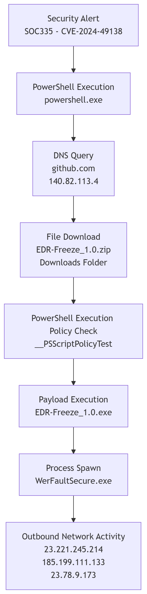

# PowerShell EDRFreeze Investigation (LetsDefend Case Study)

This repository contains a documented SOC investigation based on a LetsDefend scenario involving suspicious PowerShell activity, a GitHub-hosted payload, and execution of the EDRFreeze tool.

## What this repository includes

- Full report: [report.md](report.md)
- Timeline: [timeline.md](timeline.md)
- Indicators of compromise: [iocs.md](iocs.md)
- MITRE ATT&CK mapping: [mitre.md](mitre.md)
- Investigation screenshots: [screenshots](screenshots)

## Case summary

The investigation identified a PowerShell-driven attack chain in which the host resolved `github.com`, downloaded `EDR-Freeze_1.0.zip`, created a temporary `__PSScriptPolicyTest` file during execution policy evaluation, executed `EDR-Freeze_1.0.exe`, and then spawned `WerFaultSecure.exe`.

## Attack diagram

## Medium article

Add your Medium link here after publishing.

## Notes

This case study is based on a LetsDefend training scenario and is published for portfolio and learning purposes.
